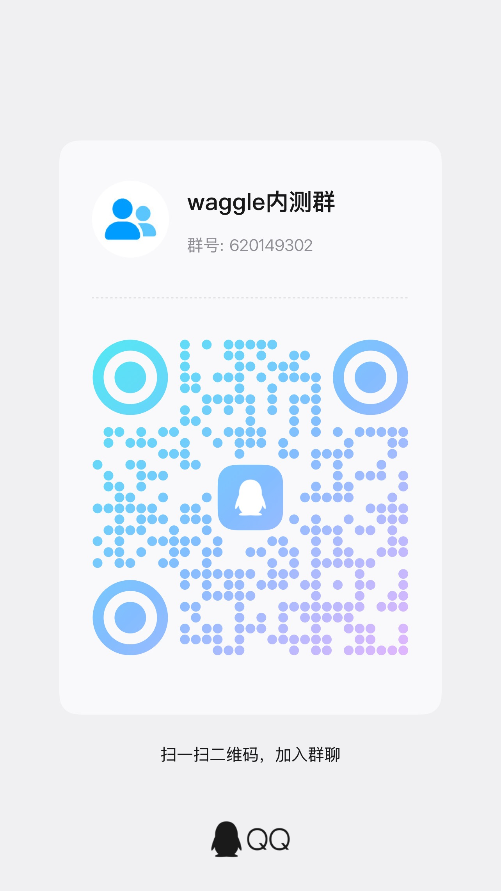
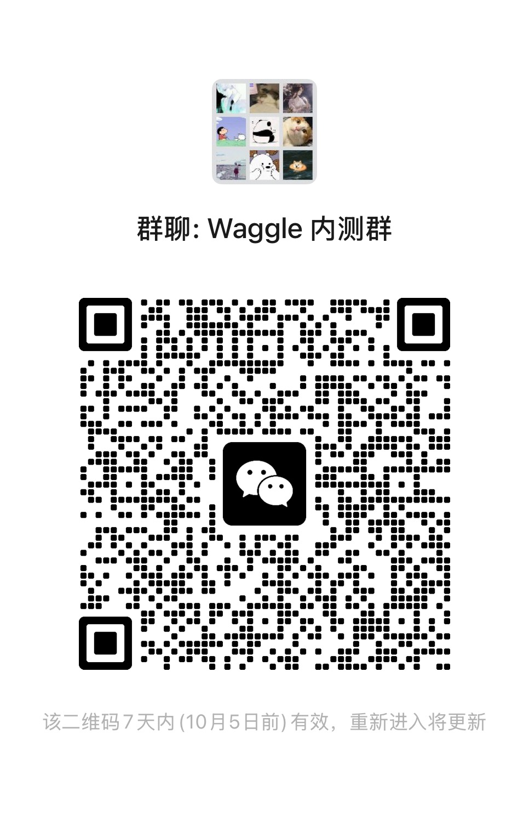

# Waggle Community

公开的 **Issue / Star** 入口。产品源码在私人仓库，这里不开放源码 PR。

**职巢 Waggle**：岗位信息一起采，投递进度各自留。

## 先体验

不用注册。手机扫码或点开链接，会进入隔离的演示环境（与正式用户数据分开）：

**链接：** https://xia.jobstock.us.ci:9443/try?code=try-waggle

## 想认真用 · 欢迎加群

演示玩够了、想要正式账号，或使用中有问题想聊——**欢迎加内测群**。正式号暂不开放自助注册，进群后由维护者统一开通。

**QQ 群号：`620149302`**（群名：waggle内测群）

| QQ 群 | 微信群 |
|:--|:--|
|  |  |

> 微信群二维码通常约 **7 天**过期（当前这张注明在 **10 月 5 日前**有效）。过期后请开 Issue 提醒我们换图，或先加 QQ 群。

## 寻求合作者

如果你也认同「招聘信息共享、投递进度私有」，愿意一起打磨产品、写文案、做设计、做校内推广，或有长期协作想法，欢迎来信：

**邮箱：[12545011@zju.edu.cn](mailto:12545011@zju.edu.cn)**

来信请简单自我介绍 + 你想一起做什么即可。

## 你可以在这里做什么

| 可以 | 不可以 |
|:--|:--|
| **体验**演示（上文链接 / 二维码） | 提 **源码 Pull Request**（看不到代码，合不进去） |
| **加群**拿正式号、聊使用问题 | 期望这里出现完整源码 |
| 开 **Issue**（bug、建议、许愿） | 把演示环境当正式账号长期用 |
| **Star** 表示关注 | |

已登录正式账号的用户：优先用站内「反馈」（更方便带页面与截图）。路人或想公开讨论，用本仓 Issue。

## 开 Issue 之前

1. 搜一下有没有类似 Issue  
2. 写清：现象 / 期望 / 复现步骤（有网址或截图更好）  
3. 不要贴简历、密码、内推隐私等个人敏感信息  

## 源码与贡献

代码仓是私人的。社区 Issue 会由维护者同步到内部跟踪；值得做的改动由维护者在私仓实现。  
若你只想改本仓的说明文档，可以开 Issue 说明要改哪里，我们代为更新。

## 相关

- 体验 / 加群 / 合作：见上文  
- 本仓只作社区入口，不部署服务  
